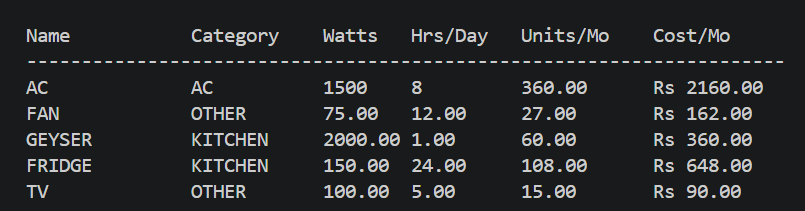
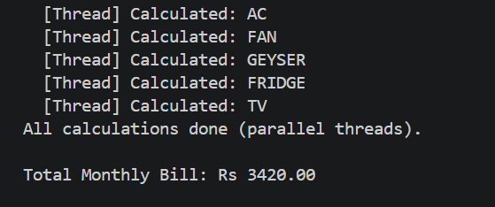
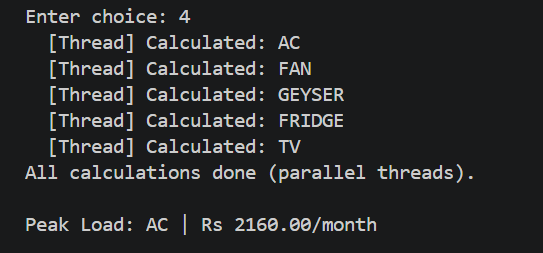
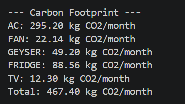
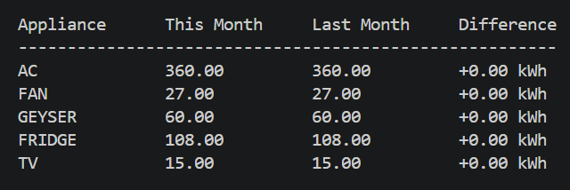

# Multithreaded Smart Home Energy Monitor

A C++ console application that monitors home appliance energy consumption using multithreading.

## Features
- Add appliances with power rating and daily usage
- Parallel calculation using C++ threads (std::thread, mutex)
- Monthly bill calculation with budget alerts
- Peak load appliance identification
- Carbon footprint calculator
- Month-over-month usage comparison
- File-based data persistence

## Tech Stack
- C++17
- std::thread, std::mutex (multithreading)
- File I/O (fstream)
- OOP (classes, encapsulation)

## How to Run
```bash
g++ -std=c++17 energy_monitor.cpp -o energy_monitor
./energy_monitor
```

## Problem Statement
Indian households often don't know which appliance consumes the most electricity. This tool provides visibility into home energy usage, identifies high-consumption appliances, helps reduce electricity bills, and calculates carbon footprint based on India's average grid emission factor (0.82 kg CO2/kWh) to promote sustainable energy consumption.

## Output Screenshots

### Parallel Thread Execution


### Monthly Bill Calculation


### Peak Load Identification


### Carbon Footprint


### Month Comparison

